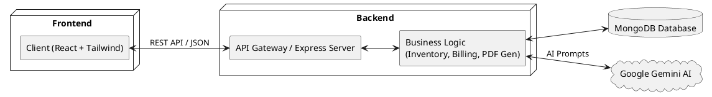
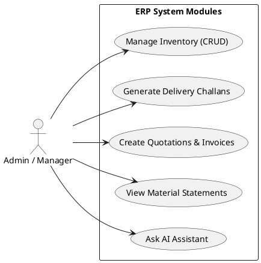
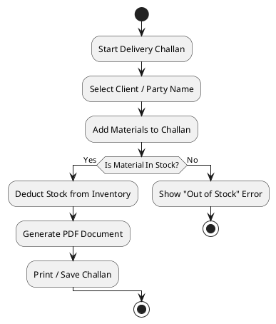
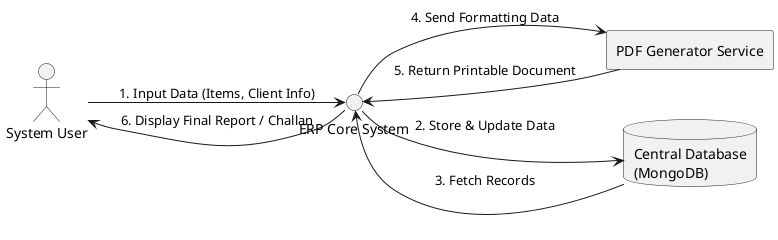
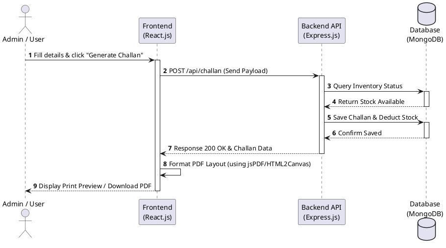

# 🏭 Industrial ERP & Inventory Management System (Case Study)

> **Disclaimer:** This repository is a case study of a proprietary Enterprise Resource Planning (ERP) system developed for an industrial client. Due to Non-Disclosure Agreements (NDA) and company policies, the source code is kept private. This README serves as a showcase of the architecture, features, and my contributions to the project.

## 📌 Project Overview
The Industrial ERP System is a comprehensive, full-stack web application designed to streamline manufacturing and inventory operations. It digitizes the workflow of material inward/outward processes, client billing, delivery challans, and real-time stock tracking. 

## 💻 Tech Stack
- **Frontend:** React.js, Tailwind CSS
- **Backend:** Node.js, Express.js
- **Database:** MongoDB
- **Tools & Integrations:** PDF Generation (A4 Layouts), Google Gemini AI (Assistant), RESTful APIs

---

## 🚀 Key Features
1. **Inventory Management:** Real-time tracking of raw materials and finished goods with low-stock alerts.
2. **Delivery Challan System:** Automated A4-sized printable Delivery Challans with professional layouts, logos, and authorized signatures.
3. **Quotation & Invoicing:** Proforma invoice generation with automatic GST (CGST/SGST) calculations.
4. **Material Statement Register:** Complex grid layouts for tracking material flow over time.
5. **AI Data Assistant:** Integrated AI chatbot using Google Gemini API to query inventory status naturally.

---

## 📐 System Architecture

This diagram illustrates the high-level architecture of the MERN stack application.

---

## 👥 Use Case Diagram

Here are the primary actions the Admin/Manager can perform within the ERP.

---

## 🔄 Activity Diagram (Delivery Challan Process)

This flowchart represents the logical flow of creating and printing a Delivery Challan.

---

## 🗄️ Data Flow Diagram (DFD Level 0)

How data moves between the User, Core System, Database, and external services.

---

## ⏱️ Sequence Diagram (Challan Generation)

How the components interact over time during the Challan creation process.

---

## 🚧 Challenges & Solutions

- **Challenge:** Creating pixel-perfect A4 printable documents (Challans/Invoices) directly from the browser without layout breaks.
  - **Solution:** Utilized custom CSS `@media print` queries, hid standard UI elements during print, and strictly managed margins to ensure predictable page breaks.

- **Challenge:** Complex data handling for "Material Statement Registers" containing 19+ columns that need to fit neatly on a single page.
  - **Solution:** Implemented vertical text orientation for table headers and dynamic column width calculations to fit extensive data arrays cleanly.

---

## 📸 Application Screenshots

*(Add your screenshots here. Make sure to blur any sensitive client data!)*

1. **Dashboard & Analytics**
   - ``
2. **Delivery Challan Print Layout**
   - ``
3. **AI Chat Assistant**
   - ``

---
*Developed with ❤️ by [Your Name]*
